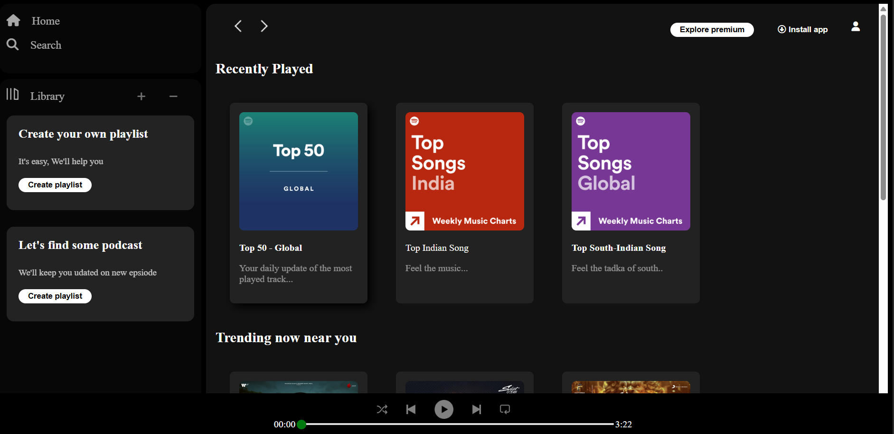

# Spotify-project
Hey there! 👋  Welcome to my Spotify Clone project — a sleek and modern recreation of Spotify’s web interface, built entirely with HTML and CSS.  I created this project to practice front-end skills, experiment with layouts, and explore how to bring real-world UI designs to life with clean code.

✨ Features

✅ Play/pause songs

✅ Next/previous track navigation

✅ Dynamic progress bar

✅ Responsive UI for mobile and desktop

✅ Animated music controls

✅ Custom playlist

✅ Use of grid,media-query,CSS Specificity & Cascade,Box Model etc

-author

Parth Sakpal

